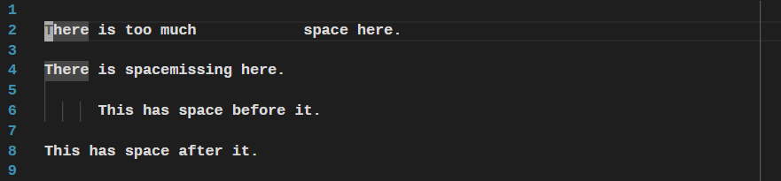
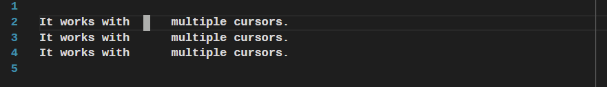
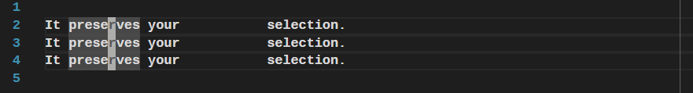

# emacs-fixup-whitespace

This emulates the behaviour of the versitile `fixup-whitespace` Emacs command
with extra support for Visual Studio Code's features.



The `emacs-fixup-whitespace.fixupWhitespace` command deletes
all whitespace at, before, and after the cursor.  Then, if it finds the cursor
not at the start or end of the line, it adds a single space.

## Features

- Quickly collapse whitespace around the cursor into a single space, as shown in
  the demo above

- Multiple cursor support.

  

- Multiple cursors can be on the same line.  If they're in the same whitespace
  region, they collapse.

  

- Selection is preserved.

  

- Use it when joining lines to delete the extra whitespace.

  

## Extension Settings

You must manually add a key binding for the new command.  For example:

```json
    {
      "key": "ctrl+f9",
      "command": "emacs-fixup-whitespace.fixupWhitespace",
      "when": "editorFocus && !editorReadonly"
    }
```

## Known Issues

Please report any bugs.

## Release Notes

### 1.0.0

Initial release.

